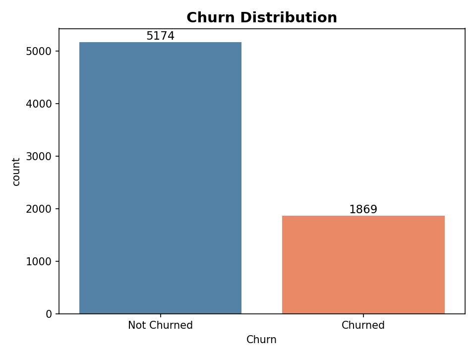
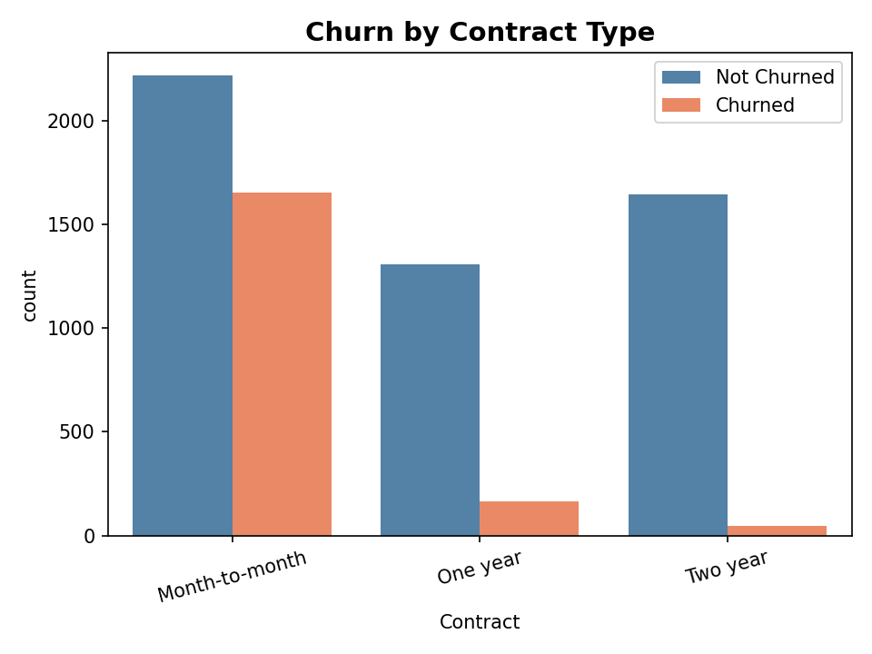
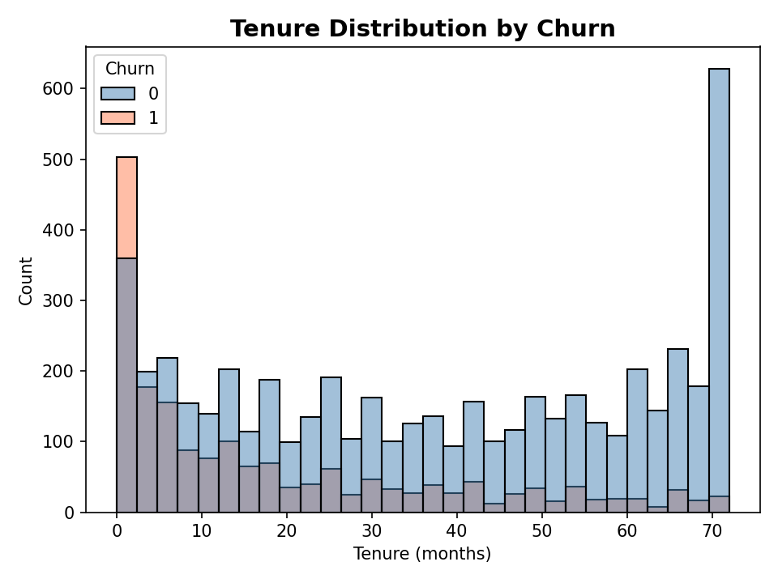
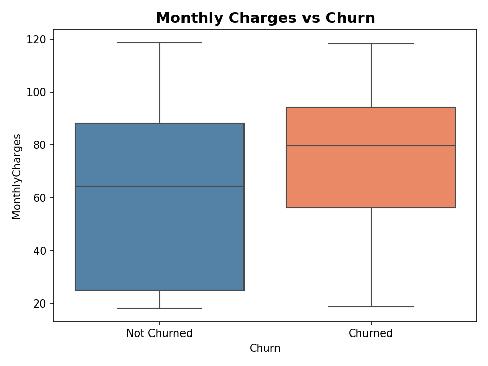

# Customer Churn Analysis & Retention Insights

## 📌 Objective

Analyze telecom customer data to identify key factors driving churn and provide actionable business insights.

---

## 📊 Key Insights

- Nearly **47.7% of customers churn within the first year**, indicating early-stage retention issues
- **42.7% churn on month-to-month contracts** vs **2.8% on 2-year plans**, showing contract type as a key driver
- **Electronic check users churn at 45.3%**, while auto-pay users show ~16% churn
- High-paying customers show **36.7% churn**, indicating price sensitivity
- Identified **2,292 high-risk customers** with over 50% churn probability
- Estimated **$139K monthly revenue loss (~30%)**

---

## 📈 Visual Insights

### Churn Distribution

### Contract Type vs Churn

### Tenure vs Churn

### Monthly Charges vs Churn

---

## 🛠 Tools Used

- Python (Pandas, NumPy)
- Data Visualization (Seaborn, Matplotlib)

---

## 📂 Project Structure

- `eda.ipynb` --> Full analysis
- `Plots/` --> Saved visualizations
- `churn_cleaned.csv` --> Cleaned dataset
